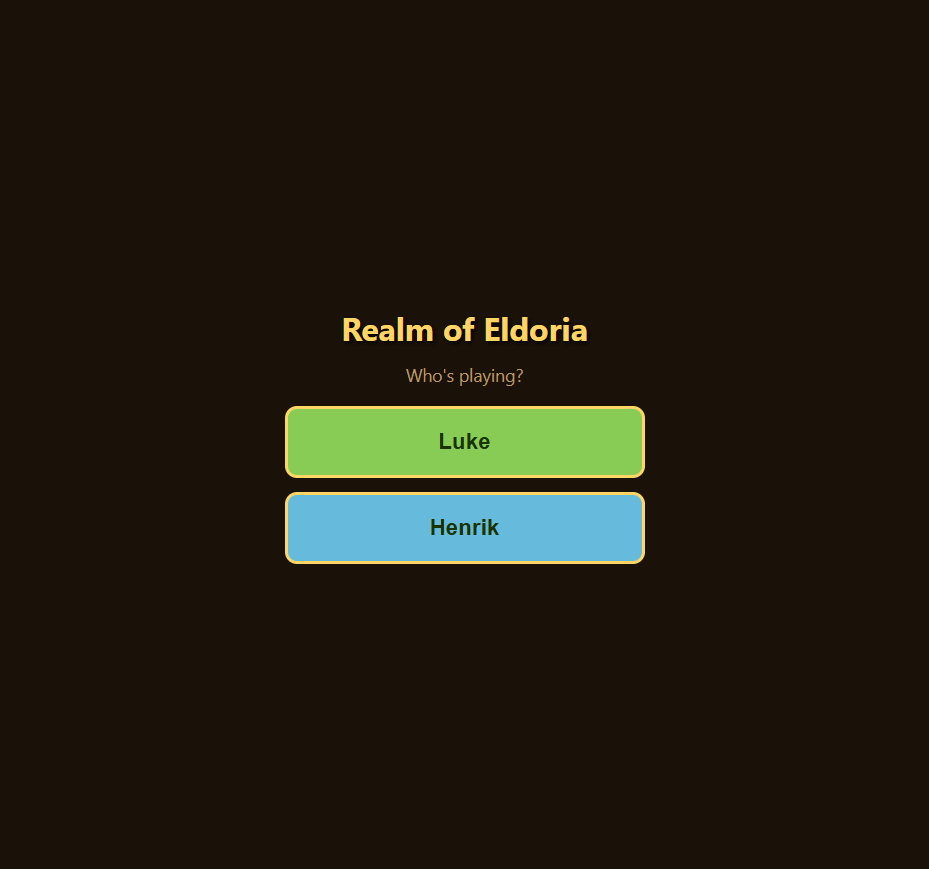

# Realm of Eldoria

A browser-based, educational farming-and-adventure RPG — a Stardew Valley–style game
where the learning hides inside the fun. Players run a farm, fight monsters in the Wilds,
and level up; the arithmetic is the lever that makes them play *better*, never a quiz that
blocks the game.

## Play it

> 🎮 **[Play it live](https://galashots.github.io/eldoria/)** (served from the public mirror)

Or run it locally: clone the repo and open `index.html` in any modern browser. No build
step, no install, no network — it works fully offline.

## How it's built

- **One self-contained `index.html`** — all HTML, CSS, and JavaScript inline in a single file.
- **Vanilla HTML/CSS/JS only.** No frameworks, no bundler, no TypeScript, no build step.
- **Runs offline**, designed for tablet Safari and touch input first.
- Saves live in `localStorage`, one save per player profile.
- Art assets sit next to the file in `assets/` and are referenced with relative paths.

## Two profiles, one engine

The game ships with two play profiles that share one world and engine. The only thing that
differs per profile is **difficulty** — the math grade level and reading level:

- An **older-reader** profile: multiplication word problems, combat, and a longer grind.
- An **early-reader** profile: audio-first prompts (read aloud via the browser's
  SpeechSynthesis API), small numbers, and big tap targets.

## Where the learning hides

| System | Math / literacy it exercises |
| --- | --- |
| Shop & economy (buy seeds, sell crops, make change) | addition, multiplication, money |
| Combat & leveling (damage, HP, XP) | number sense, subtraction, estimation |
| Crafting & cooking (recipes, doubling) | counting, ratios, sequencing, reading |
| Farm grid (rows × columns) | multiplication, area |
| Quests & dialogue | reading comprehension (voiced for early readers) |

## Development

Built in small, testable slices — see [`PROGRESS.md`](PROGRESS.md) for the running log and
[`CLAUDE.md`](CLAUDE.md) for the design rules and constraints.

Every push runs three checks (see [`.github/workflows/ci.yml`](.github/workflows/ci.yml)):

- a **smoke test** that boots `index.html` headlessly and fails on any console error,
- a **gameplay logic test suite** (farming, shop, combat, cooking, save migrations) driven
  through a Node DOM-stub harness, and
- a **Lighthouse accessibility audit** (contrast, labels, etc.) to keep the game usable for
  the youngest player.
