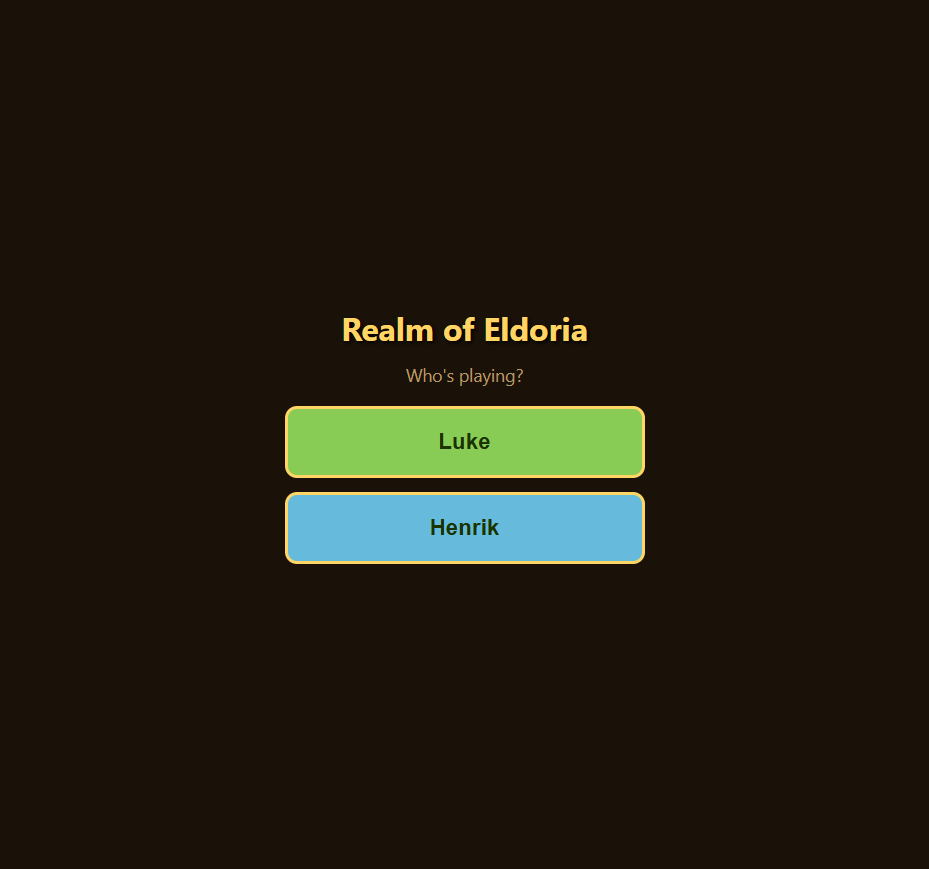
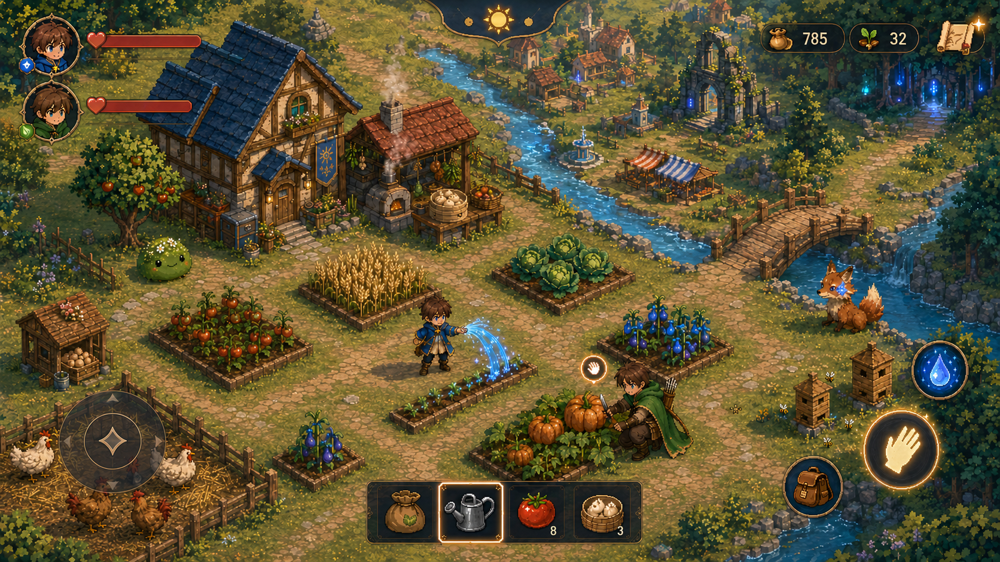

# Realm of Eldoria

A browser-based, educational farming-and-adventure RPG — a Stardew Valley–style game
where the learning hides inside the fun. Players run a farm, fight monsters in the Wilds,
and level up; the arithmetic is the lever that makes them play *better*, never a quiz that
blocks the game.

## Play it

> 🎮 **[Play it live](https://galashots.github.io/eldoria/)** (served from the public mirror)

Or run it locally: clone the repo and open `index.html` in any modern browser. No build
step, no install, no network — it works fully offline.

## How it's built

- **One self-contained `index.html`** — all HTML, CSS, and JavaScript inline in a single file.
- **Vanilla HTML/CSS/JS only.** No frameworks, no bundler, no TypeScript, no build step.
- **Runs offline**, designed for tablet Safari and touch input first.
- Saves live in `localStorage`, one save per player profile.
- Art assets sit next to the file in `assets/` and are referenced with relative paths.

## Visual direction

The owner-approved [Visual North Star](docs/VISUAL_NORTH_STAR.md) guides isometric
projection, world spacing, environment and character art, farming presentation, and the
touch-first HUD. Agents must inspect it for visually relevant reviews and follow its
versioned supersession protocol when the game's evolving direction needs a new reference.

## Two profiles, one engine

The game ships with two play profiles that share one world and engine. The only thing that
differs per profile is **difficulty** — the math grade level and reading level:

- An **older-reader** profile: multiplication word problems, combat, and a longer grind.
- An **early-reader** profile: audio-first prompts (read aloud via the browser's
  SpeechSynthesis API), small numbers, and big tap targets.

## Where the learning hides

| System | Math / literacy it exercises |
| --- | --- |
| Shop & economy (buy seeds, sell crops, make change) | addition, multiplication, money |
| Combat & leveling (damage, HP, XP) | number sense, subtraction, estimation |
| Crafting & cooking (recipes, doubling) | counting, ratios, sequencing, reading |
| Farm grid (rows × columns) | multiplication, area |
| Quests & dialogue | reading comprehension (voiced for early readers) |

## Development

Built in small, testable slices — see [`AGENTS.md`](AGENTS.md) for shared agent rules,
[`CLAUDE.md`](CLAUDE.md) for the Claude entry point, and
[`docs/CURRENT_STATE.md`](docs/CURRENT_STATE.md) for the current implementation state and next
accepted outcome. Owner-designated large deliveries also follow
[`docs/LARGE_PR_EXECUTION.md`](docs/LARGE_PR_EXECUTION.md), and
[`docs/CREATIVE_DIRECTION.md`](docs/CREATIVE_DIRECTION.md) holds the owner-approved story, quest,
Squishy Dumpling, learning, and content-driven asset direction.

Every push to `main` and every pull request runs `npm test` in the single CI job defined by
[`.github/workflows/ci.yml`](.github/workflows/ci.yml). The current script chain is the source of
truth in [`package.json`](package.json); it covers deterministic asset integrity/build checks,
Ranger proof validation, headless boot smoke, and isometric gameplay/interaction tests. CI uploads
generated PNG/JSON playtest evidence from `artifacts/` when present. Visual quality still requires
human image inspection; the automated suite does not run a Lighthouse audit.
