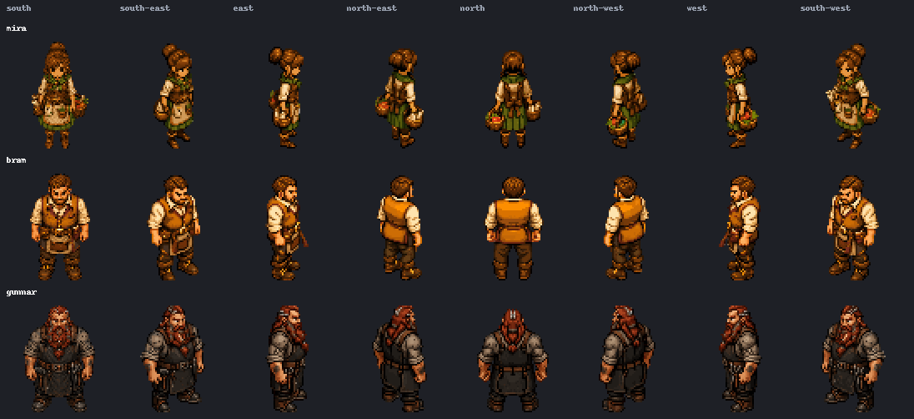

# Town NPC sprite integration — 2026-08-05

## Scope

This bounded integration replaces the isometric Town fallback shapes for Mira,
Bram, and Gunnar with one losslessly processed south-facing idle frame per NPC.
The current NPC data has no facing, walk, or animation state, so the renderer
uses the PixelLab `south` source direction, which maps to Eldoria's
`down-right` engine slot. The existing procedural shape remains the fallback,
and the legacy top-down `assets/npc_mira.png` path is unchanged.

All 24 supplied idle directions are now retained as canonical source assets
under `source-rotations/`. They are not wired into runtime; adding a
facing/state system would expand this workstream.

## Supplied source packs

Each ZIP contains exactly eight idle rotation PNGs under `Idle/rotations/` plus
`metadata.json`. There are no walk, attack, hurt, or other animation frames.
Every source PNG is 128×128 RGBA with transparent outer canvas and binary alpha.

| NPC | PixelLab character ID | Directions | ZIP SHA-256 |
| --- | --- | ---: | --- |
| Mira | `fe739371-4690-48f1-bac3-dcbe9b76c4d1` | 8 idle | `02507CF04FE9CEE1694D73E4E90751437AF7DE0E6AE3A37D3A2E0E679F4CE41F` |
| Bram | `c51c8a9f-4f10-4dde-9cec-2db6b7988512` | 8 idle | `C8E2A1A6F827B0943E5559756BCA41D7EE847615A672EDA5F630157C7BC10303` |
| Gunnar | `aa10971b-ebbf-4293-b701-5b28db54c9a9` | 8 idle | `14A5887F4BFF3A0D29725910086699EF7EB573F30DEFA1E9C2329C4856B054EF` |

The source prompts and exports identify the intended roles: Mira is a warm,
capable Town steward with apron, tied-back hair, travel clothes, and produce
basket; Bram is a sturdy bearded General Store keeper with merchant apron and
pouches; Gunnar is a broad, weathered dwarf-style smith/material historian with
red-grey beard and forge apron. The source metadata declares `high top-down`.

The 24 processed source files are retained at:

- `source-rotations/mira/{south,south-east,east,north-east,north,north-west,west,south-west}.png`
- `source-rotations/bram/{south,south-east,east,north-east,north,north-west,west,south-west}.png`
- `source-rotations/gunnar/{south,south-east,east,north-east,north,north-west,west,south-west}.png`

The complete deterministic provenance and direction mapping are recorded in
[`npc-direction-map.json`](npc-direction-map.json).

## Deterministic lossless processing

`tools/pipeline/process_npc_static.py` is the reproducible processor. For each
128×128 source frame it:

1. verifies RGBA dimensions and binary alpha;
2. crops only the transparent outer margin around the opaque character pixels;
3. places that exact RGBA crop on a 64×64 transparent canvas, horizontally
   centered and translated so the lowest opaque row is row 63.

It never resamples, recolours, thresholds, sharpens, mirrors, flips, or redraws
source pixels. The report proves the source-crop RGBA hash equals the output
crop RGBA hash for all 24 directions. The three runtime files are byte-identical
to their corresponding processed `south` source frames.

The vendor-to-engine mapping is direct and contains no mirroring:

| PixelLab direction | Engine slot |
| --- | --- |
| `south` | `down-right` |
| `south-east` | `right` |
| `east` | `up-right` |
| `north-east` | `up` |
| `north` | `up-left` |
| `north-west` | `left` |
| `west` | `down-left` |
| `south-west` | `down` |

The selected runtime files are:

- `assets/iso/npc/mira-down-right.png`
- `assets/iso/npc/bram-down-right.png`
- `assets/iso/npc/gunnar-down-right.png`

`tools/pipeline/validate_sprites.py` was run statics-only against all eight
engine slots per NPC, without `--require-walks`. G1–G4 pass for every frame.
The shared hero G5 silhouette-width gate remains an expected bounded source-art
finding (Mira 5px height / 13px width, Bram 11px width, Gunnar 17px width in
the lossless frames), so it is not weakened or relabeled as a pass.
`tools/npc-static-contract-test.py` is the
NPC-specific custody gate for exact source pixels, dimensions, alpha, bottom
anchor, horizontal centering, and runtime/source equality.

## Runtime behavior and anchor

`js/02-data-state.js` registers the three `iso_npc_*_down_right` assets.
`js/08-iso-renderer.js` draws them at the existing Town footprint: the 64×64
frame is positioned at `(cx - 32, cy - 48)`, so its feet meet the tile's south
corner at `(cx, cy + 16)`. The procedural body/head shape remains the fallback
if an image is unavailable. Interaction, NPC positions, top-down fallback
behavior, save data, and gameplay roles are unchanged.

North Star alignment: **Intentional interim gap.** The supplied sprites move
Town toward the North Star's crisp pixel-art character language and high
top-down/isometric readability, but this work does not claim complete
directional NPC animation or final visual approval. Non-author visual review and
Leo's runtime acceptance remain required.

The real-render evidence set under
`docs/playtest/2026-08-05-npc-sprite-integration/` includes focused desktop
captures for Mira, Bram, and Gunnar plus Mira at iPad-landscape and phone
portrait sizes. The focused positions keep each NPC in the camera view instead
of claiming that one phone frame can show the whole Town.
